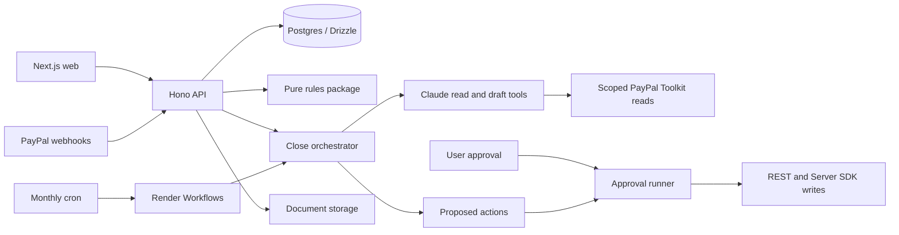

# Architecture

The [product plan](PLAN.md) owns scope. Through Phase 6, Niryat implements sign-in, profiles, health/export checks, clients, invoice PDFs, approved sandbox invoicing/refunds/reminders, ledger ingestion, dispute polling, tasks, FIRA matching, source-quoted extraction, monthly close, GSTR-1 preview/CSV, advance-tax estimates, a compliance calendar and an AI-assisted dashboard. Phase 6 local acceptance is user-confirmed (2026-11-01), except the blocked CSV-import check; sponsor licence coverage remains unverified. FIRA parsing remains verified only against a synthetic fixture. Hosting and reliability remain Phase 7; see [verification](verification.md).

## Components and flow

```mermaid
flowchart LR
  Web[Next.js web] --> API[Hono API]
  Hooks[PayPal webhooks] --> API
  API --> DB[(Postgres / Drizzle)]
  API --> Rules[Pure rules package]
  API --> Close[Close orchestrator]
  Worker[Render Workflows] --> Close
  Cron[Monthly cron] --> Worker
  Close --> Claude[Claude read and draft tools]
  Claude --> Reads[Scoped PayPal Toolkit reads]
  Close --> Queue[Proposed actions]
  User[User approval] --> Runner[Approval runner]
  Queue --> Runner
  Runner --> PayPal[REST and Server SDK writes]
  API --> Files[Document storage]
```

Verified PayPal events and transaction backfill populate the ledger. Issuing an invoice creates a PDF and persistent proposal; user approval permits PayPal execution. Refund/dispute records feed cited messages, tasks and reports. Uploaded FIRA PDFs are parsed and matched without AI; uncertain matches require confirmation. Claude investigates/drafts and configures dashboard widgets; it does not compute compliance figures.

## Sign-in

Sign-in uses the existing sandbox app's authorization-code flow and server-side userinfo. A unique payer ID identifies returning users; an email collision does not link accounts, and no login token is retained. PayPal-only users have a nullable password hash (migration `0004_closed_mantis`). Both sign-in methods use the existing signed session cookie. The app owner uses email sign-in; seller operations still use that app owner's credentials. In local development the web proxy targets `API_URL=http://localhost:3001`, while browser links and the callback use `PUBLIC_APP_URL`.

## Three-layer PayPal integration

| Layer                 | Owner                    | Responsibility                                       |
| --------------------- | ------------------------ | ---------------------------------------------------- |
| TypeScript Server SDK | packages/paypal/src/sdk  | Transaction search and refunds                       |
| PayPal Agent Toolkit  | packages/agent           | Five projected, owner-scoped read-only agent tools   |
| Typed REST client     | packages/paypal/src/rest | Invoicing v2 and Disputes v1, absent from Server SDK |

Webhook verification belongs to packages/paypal/src/webhooks and uses PayPal's verify API before ingestion. The Server SDK supplies capture/refund reads, approved refunds and paginated transaction search through the ledger adapter. The REST client implements Invoicing and Disputes with cached OAuth tokens, POST request IDs, validation and action-specific retries. Reminders explicitly disable retries because endpoint idempotency is unverified ([ADR 0004](decisions/0004-reminders-via-rest.md)). Toolkit reads are implemented; Toolkit writes remain deferred. See [PayPal guide](paypal.md).

## Corrections and proof

Refund notifications, approved refunds and reconciliation converge on `recordRefundById`: read the completed refund, ensure its capture is recorded, link it to an invoice and persist a positive refund row with PayPal's fee/net fields. Invoice-refund notifications first read the current invoice's PayPal refund IDs through REST. An unlinked refund stays in the ledger without a user task. One SQL roll-up computes invoice payment/refund status; `creditNoteFor` and `realisationFor` supply the compliance view. A lost dispute alone never subtracts money.

Dispute webhooks and the sync's seven-day Disputes API poll converge on `recordDispute`. It ensures the first disputed capture, preserves invoice links and ignores stale PayPal updates. Only linked disputes create user tasks. `ensureTask` deduplicates refund/opened-dispute/lost-dispute tasks by stable keys; only the user marks them done. Invoice and task reads are owner-scoped. Local `pnpm dev` does not schedule reconciliation: run `sync:payments` manually when a webhook is missed.

FIRA upload requires a session, `application/pdf`, explicit storage consent and at most 2 MB. The API checks PDF bytes, extracts text with `unpdf`, validates the deterministic parser's output and rejects unreadable documents before storage. SHA-256 detects duplicates per user. Matching accepts an exact reference/amount/currency match at full confidence; amount/date suggestions wait for confirmation. A payment is reserved only once. The database saves the document, source lines and matches atomically; invoice status is matched, pending or missing based on payment matches and covered months. See [spec 07](specs/07-fira-matching.md) for the synthetic-layout limitation and demo seed.

## Approval and trust boundaries

Every PayPal write requires explicit user approval. Issuing saves an immutable invoice/PDF and proposed `agent_actions` payload without calling PayPal. The authenticated approve route checks ownership, then the runner atomically claims a proposed or failed invoice/refund action before execution. Created PayPal IDs survive retries with stable `<actionId>-<step>` request IDs. Reminders can claim only `proposed`, permit one attempt and cannot resend after failure or interruption; unknown outcomes also cannot be rejected as unsent. Success finishes as done; rejection is final. Webhook verification/reconciliation are deterministic ingestion paths. The in-product agent may use only scoped, logged Toolkit reads without approval ([ADR 0005](decisions/0005-agent-boundary.md)); it has no write or approval tools.

Zod validates external inputs and environment values. Rules are pure, versioned and cited; AI handles extraction, investigation, explanations and widget configuration, never legal or numeric truth. FIRA matching remains deterministic. All twelve YAML `logic` entries now name implemented functions; none remains `TODO`.

## Agents, close and extraction

The close orchestrator first syncs payments/disputes, loads owner-scoped invoice views, ensures overdue tasks, builds SQL month totals and FIRA status, and selects rule-due reminder candidates. Claude then investigates with Niryat reads and five Toolkit wrappers (`get_invoice`, `list_invoices`, `get_dispute`, `list_disputes`, `list_transactions`) before drafting advice, tasks and a focus summary. Code validates known entities, digit-free narrative and proposal stages, then persists immutable proposed actions and deduplicated tasks. Every due candidate gets a standard-reminder proposal even when Claude is missing, fails, exhausts its budget or skips a candidate; those proposals carry `agent: null`. Rejected stage keys remain reserved. An older pending stage is not replaced when the next stage arrives.

`agent_runs` stores user, kind, trigger, month, `asOf`, status, structured summary and estimated AI cost. One running row per user/kind is allowed; a later start can fail a row stale after 15 minutes. `agent_tool_calls` stores sequential system/agent inputs, outputs and outcomes. Toolkit response logs contain item/byte summaries, not raw PayPal bodies. Projections drop PayPal personal fields and filter known ownership before Claude sees data. Model text is advisory; deterministic figures and citations remain available after AI failure.

The SDK has no built-in tools, filesystem settings or persisted sessions, and sees only Niryat's supplied MCP server. Its minimal subprocess environment excludes PayPal, storage and database credentials. Bare `allowedTools` can bypass the redundant `canUseTool` callback; validation/dispatch wrappers and absence of execution tools enforce the actual boundary. A deployment-wide monthly cost estimate, turn bounds and per-run caps constrain AI use. Concurrent/in-flight costs can overshoot the monthly cap by a run; this is not a provider billing guarantee.

`POST /close` starts a current-IST-month manual run, returns HTTP 202 and runs work inside the API process. The page refreshes every three seconds while running; concurrent starts return 409. `close:run` and the Workflows task run scheduled closes over users sequentially, defaulting to the previous IST month. The CLI accepts `--month` and `--as-of` directly, without an extra `--` separator. Demo `asOf` affects rule dates and real dedupe keys; it does not rewind PayPal data or the run timestamp. The nightly sync runs only the reminder agent when new candidates exist. Manual API work is not durable across process restarts; Phase 7 must verify recovery without replaying claimed reminders.

Extraction sends the brief once to a separate Claude draft tool. Code checks each field against its verbatim quote, including full amount/email tokens and negative signs, before showing it. Logs retain found field names and run/cost metadata, not the brief. `Use these values` only prefills forms; existing-client matching is explicit, export answers and SAC stay with the user, and Discard saves no client, invoice or action. Form submission issues the invoice, and user approval separately permits its PayPal send. Missing/budget-exhausted AI leaves manual forms available.

## Reports, calendar and dashboard

`GET /gstr1` supplies `/gstr1` with rules-derived periods/due dates, LUT coverage and per-currency invoice/refund/net reconciliation. `POST /gstr1/file` emits the ten-column WOPAY CSV with user-entered per-invoice INR rates and applicable GST percentages. Refund credit-note data is listed separately for Table 9B. GST registration and filing frequency gate the report. Offline-tool parser acceptance remains blocked before import.

`GET /advance-tax` supplies the server-rendered GET form at `/advance-tax`. Invoice-linked payments/refunds are selected by IST receipt date in the tax year; rates are supplied per currency. Rules determine presumptive eligibility/deemed income and instalment dates/amounts from the user's estimated tax. No income-tax liability or slabs are computed. Rates remain request-only in both report flows.

`GET /calendar` supplies `/calendar` with rule/profile/invoice/dispute events. Bryntum Calendar/React 7.3.8 runs client-only in read-only month/list modes, with state prefixes and colours. A server-rendered list links every overdue event and the next ten upcoming ones. Recurring dates remain expectations because series cycles are unlinked.

`GET /dashboard` projects owner-scoped ledger/health rows without client email/address fields or health-flag citations. AG Studio/React 3.0.0 renders the seven required widget groups with Niryat theme tokens; refunds and disputes use separate tiles. Display sums may use floating point; compliance figures come from rules/PayPal records. Missing PayPal FX remains missing, and bank FX loss is not computed. Edit mode exposes the AI Assistant and layout controls.

AG Studio's Agent Framework uses a browser adapter to `POST /dashboard/turn`. The API validates the bounded text/tool wire subset, session, deployment-wide budget and per-user concurrency, records a charged `dashboard` run and calls the server-only Claude Messages adapter. Tools execute in the dashboard; no PayPal tools are exposed. Digit-containing model prose becomes a figure note; arguments remain intact. Logs keep tool names/argument keys and sanitized status codes, never prompts, argument values, model text or keys. Replies are buffered and replayed as AG events, not server-streamed. Client names and projected ledger data go to Anthropic. Thinking blocks remain unsupported; model-compatibility guidance preceded successful user question checks. See [V16](verification.md#v16-phase-6-acceptance).

`AG_STUDIO_LICENSE_KEY` is read by the web server and passed to the browser by design; absent keys use trial behavior. Bryntum uses the trial alias; `BRYNTUM_LICENSE_KEY` is a hosting declaration, not read by the wrapper. Installation/rendering do not prove trial dates or judging permission; [V15](verification.md#v15-sponsor-licences) remains open.

## Storage and runtime

apps/web uses Next.js App Router; apps/api uses Hono on Node 24. Shared packages export TypeScript source; their build step checks types, while Next produces production assets. apps/worker registers the `monthlyClose` task with Render's SDK and a 900-second timeout, validates input and calls the shared close composition root.

The web app proxies /api/* to the API through Next rewrites, so the session cookie stays same-origin.

Rate limits ignore `X-Forwarded-For`. The API trusts validated `CF-Connecting-IP` only when Render's server environment sets `RENDER=true`; elsewhere, or without a valid header, it uses the connection address. [Render's public ingress overwrites that header](https://render.com/articles/host-pocketbase-on-render#making-pocketbase-see-the-real-client-ip). The Blueprint binds web's `API_INTERNAL_HOSTPORT` to the API's private-network `hostport`; both the rewrite and server-side reads prefer it over `API_URL`, keeping the original ingress header across the web-to-API hop. Same-workspace private services are trusted. The API remains public for existing direct URLs and webhooks. A public web-to-API hop would replace the header with the web service's IP and combine users' limits, so keep this hop private. Limits are in-memory per API instance and reset on restart; AI/share keys also include the verified session user ID. Hosted proxy behavior remains awaiting user verification.

Web route groups preserve public URLs: `(public)` contains home, login, signup and disclaimer; `(app)` contains `/overview` (Today) and the signed-in pages. The app layout validates `/auth/me` with the shared session schema before rendering the account email and shell. Its single `nav-menu` aside is the desktop sidebar and the mobile native popover; only that nav renders the reminder-proposal count. Root `app/error.tsx` catches app-layout failures with `retry`; app loading and independent overview card boundaries provide partial feedback. Sponsor imports remain route-scoped, outside the shell import graph. `lib/format.ts` supplies display-only IST dates and decimal-string money formatting; compliance calculations remain in rules.

Drizzle declares the fourteen tables from PLAN section 13. Migration `0005` adds runs/tool calls; `0006` adds nullable profile `gstr1_frequency` and `specified_profession` and permits the `dashboard` run kind. Migrations live in packages/db/drizzle; createDb in packages/db/src/client.ts; GSTIN, PAN fragments and profile/client addresses are AES-GCM encrypted. Invoice PDFs use private S3-compatible storage (local SeaweedFS in development). The API streams them through `/files/:token`, exposed by the web proxy as `/api/files/:token`; the PDF link is included in the PayPal invoice note. FIRA PDFs use the same private store under `fira/<userId>/<documentId>.pdf`, with no public token or link; source text is stored in plaintext in Postgres. `seed:fira-demo` creates a demo ledger only for an account with no invoices. See [local storage](local-storage.md) for setup and its development-only encryption limitation.

The Render Blueprint defines two web services, a workflow service, paid Postgres and two crons. `niryat-sync` runs the seven-day reconciliation at `30 20 * * *` UTC (02:00 IST). `niryat-monthly-close` runs at `30 1 1 * *` UTC (07:00 IST on the first), dispatching `niryat-worker/monthlyClose` with the SDK; the task itself has no schedule. Local P5-13 acceptance used the API CLI fallback, not Workflows dev. Hosted task registration, both crons, webhook delivery, sync freshness and restart recovery remain [Phase 7 checks](build-flow.md#phase-7-judge-mode-hosting-and-freeze-nov-58).
